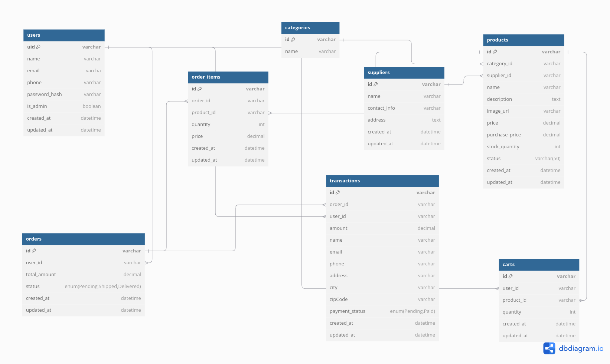

# Glam Beauty Shop E-commerce Project

## Overview

This is a Flask-based Beauty Shop E-commerce application that allows users to register, browse and purchase beauty products, manage orders, and simulate payments. Admin users can manage products, orders, and view analytics. The backend is built with Flask and uses JWT for user authentication, while the frontend is built using React. The project simulates a fully functioning e-commerce store, complete with product listings, order management, and a cart system.

---

## Features

- **User Registration and Login**: Secure registration and login system using JWT.
- **Product Browsing**: Browse products by categories and filter by status.
- **Cart Management**: Users can add products to their cart, view the cart, and proceed to checkout.
- **Order Management**: Users can place orders and track their order status.
- **Admin Dashboard**: Admins can create, update, and delete products and view order summaries.
- **Transaction Simulation**: Simulate payments and track the transaction status.
- **Analytics & Reports**: Admin can view sales data and transaction reports.

---

## Database Diagram

Below is the database schema for the Beauty Shop E-commerce application:



---


## Installation

### Prerequisites

1. Install Python

### Backend Setup

1. Clone the repository:
    ```bash
    git clone git@github.com:toxidity-18/GLAM-BACKEND.git

    cd GLAM-BACKEND
    ```

2. Create and activate a virtual environment:
    ```bash
    python3 -m venv venv
    source venv/bin/activate
    ```

3. Install dependencies:
    ```bash
    pip install -r requirements.txt
    ```

4. Set up the database:
    ```bash
    flask db init
    flask db migrate
    flask db upgrade
    ```

5. Run the Flask application:
    ```bash
    flask run
    ```

   The backend should now be running at `http://127.0.0.1:5000`.

### Frontend Setup

1. Install the dependencies:
    ```bash
    npm install
    ```

2. Start the React application:
    ```bash
    npm run dev
    ```


## Endpoints

### Authentication

- **POST /login**: User login (returns JWT token for authenticated users).
    - Request body:
      ```json
      {
        "email": "user@example.com",
        "password": "yourpassword"
      }
      ```
    - Response:
      ```json
      {
        "isAdmin": true,
        "access_token": "jwt_token",
        "data": {
          "uid": "user123",
          "name": "John Doe",
          "email": "user@example.com"
        }
      }
      ```

### Users

- **GET /users**: List all users (requires JWT).
- **GET /users/{uid}**: Get a user by UID (requires JWT).
- **POST /users**: Create a new user.
- **PUT /users/{uid}**: Update a user (requires JWT).
- **DELETE /users/{uid}**: Delete a user (requires JWT).

### Products

- **GET /products**: Get a list of products.
- **POST /products**: Add a new product (admin only).
- **GET /products/{product_id}**: Get details of a product.
- **PUT /products/{product_id}**: Update a product (admin only).
- **DELETE /products/{product_id}**: Delete a product (admin only).

### Orders

- **GET /orders**: Get orders for the logged-in user.
- **POST /orders**: Place a new order.
- **GET /orders/{order_id}**: Get details of a specific order.
- **PUT /orders/{order_id}**: Update order status (admin only).
- **DELETE /orders/{order_id}**: Delete an order.

### Transactions

- **GET /transactions**: Get a list of transactions.
- **POST /transactions**: Create a new transaction (admin only).
- **GET /transactions/{txn_id}**: Get details of a transaction.
- **PUT /transactions/{txn_id}**: Update a transaction's payment status.

---

## Database Models

- **User**: Contains user details like email, password, and admin status.
- **Product**: Stores product details such as name, price, description, stock quantity, and category.
- **Order**: Represents an order placed by a user.
- **OrderItem**: Represents a product item in an order.
- **Transaction**: Represents a payment transaction related to an order.
- **Category**: Represents product categories.
- **Supplier**: Represents suppliers providing products.

---

## Notes

- JWT tokens are required for accessing secured routes (e.g., managing products, orders, and transactions).
- Admin users have additional privileges, such as managing products, orders, and viewing analytics.


## Contributing

Feel free to fork the repository and submit pull requests. If you find bugs or have suggestions, open an issue in the GitHub repository.

---

## Contact

For any questions or feedback, feel free to reach out to the project maintainers.
